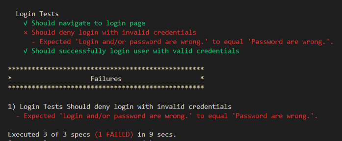

## About
A complete Test Architecture using **Protractor** with **Jasmine** framework. 
Folder structure has been setup in a way to expand the solution without digging into every folder and file. 
Files & folders have been named according to their functionality/purpose. 
The AUT is a demo bank app, project includes Login tests with valid and invalid credentials.
Chrome browser is configured currently for running tests.

### Tech Stack

* [Protractor](https://www.protractortest.org/) - A popular end-to-end or integration test framework for Angular and AngularJS applications. Built on top of WebDriverJS, can also be used for non-angular applications (because why not?). Not the fastest but still fast enough for most projects. 
Very easy to setup as it has minimal configurations but can be expanded for advance tasks. 

* [Jasmine](https://jasmine.github.io/) - Jasmine is a BDD framework for testing JavaScript code. Provides a clean, obvious syntax. It has its own set of assertions/expectations which are built with the function  `expect` which is chained with a Matcher function which takes the expected value. Matcher function is responsible for reporting to Jasmine if the expectation is true or false. Jasmine will then pass or fail the spec (test). There is also an ability to write your own custom matchers if required. 

## Installation

### Setup Scripts

* Clone the repository into a folder
* Go inside the folder and run the following command from terminal/command prompt
```
npm install 
```
* All the dependencies from package.json would be installed in node_modules folder.


### Run Tests

* Go inside the project folder and run the following command
```
protractor conf.js
```

* Browser window should pop up and you would be able to see the tests being performed. 

## Writing Tests

Jasmine framework has been integrated with this project, supports BDD style tests with Describe and It blocks.

```
const HomePageActions = require("../page_actions/homepage_action")
describe('Login Tests', () => {
    beforeAll(function(){
        browser.driver.get("http://zero.webappsecurity.com/");
    });

    const homePageActions = new HomePageActions();
    
    it("Should navigate to login page", function(){
       homePageActions.goToSignInPage();
       expect(browser.driver.getTitle().getText()).toEqual('Zero - Log in');
    });
});    
```

## Page Objects

This framework is strictly writing using page-object design pattern.

```
const LoginPage = function () {
    this.loginForm = element(by.id("login_form")); 
    this.username = element(by.xpath(".//input[@id ='user_login']"));
    this.password = element(by.xpath(".//input[@id = 'user_password']"));
    this.submitBtn = element(by.name("submit"));
  };
module.exports = LoginPage;
```

We have here a whole directory `/page_objects` which just consists of page objects related to specific pages (Page Factory), which is done in order to keep it simple.
These objects are utilized in the `/page_actions` classes which consists of (as the name implies) actions related to specific pages and also in the tests as well.

So we have actions which we can be easily re-use if needed. 
Coming towards to the `/tests/loginTests.js`: It’s a good practice to have just 'expectations' in your tests. Everything else is encapsulated. 
Very easy to read and maintain.

## Reporting

Jasmine spec reporter has been configured in this project for a better viewing (much better than the default protractor dot reports ;D) of results in the console. 
Of course there are more advance reporting tools for example, Allure Reports but for now I think it does the job. 
The test progress can be seen while the test is executing in the console window and after completion a summary will be displayed.

